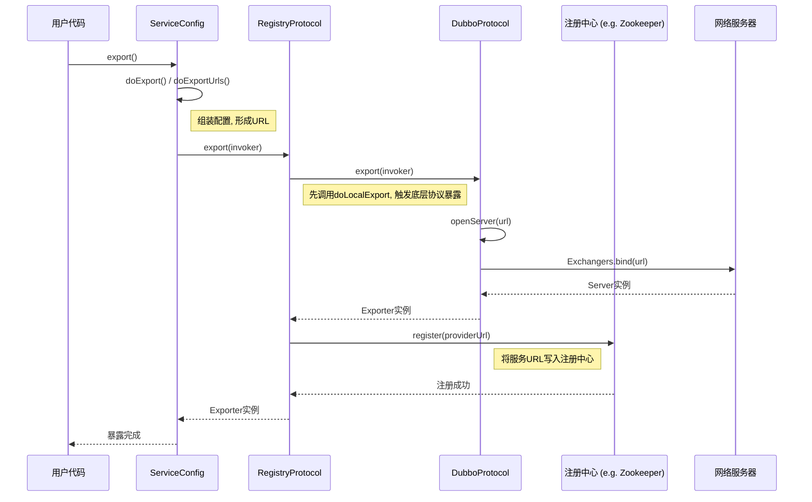

# Dubbo 服务暴露与注册流程解析

对于初学者而言，理解一个服务的发布（暴露）与注册过程是掌握 Dubbo 核心脉络的关键。这个过程始于用户的配置，终于服务信息写入注册中心（如 Zookeeper），并启动网络端口监听请求。

下面，我们将以最核心的逻辑为主线，梳理从入口到完成注册的完整流程。

## 一、 核心流程与关键代码

整个过程可以概括为：`ServiceConfig` 组装和检查配置 -> 通过 `RegistryProtocol` 封装 -> `RegistryProtocol` 先向注册中心发起注册 -> `RegistryProtocol` 再调用底层协议（如 `DubboProtocol`）暴露服务 -> `DubboProtocol` 启动网络服务器（如 Netty Server）。

这是一个典型的装饰器模式应用，`RegistryProtocol` 装饰了 `DubboProtocol`，在原有功能（启动服务器）之上增加了注册的功能。

---

### **第1步：入口 - `ServiceConfig.export()`**

这是用户侧发起服务暴露的入口。无论是通过 XML 配置的 `<dubbo:service>` 还是注解 `@Service`，最终都会被解析成 `ServiceConfig` 对象，并调用其 `export()` 方法。

- **关键操作**：检查配置，判断是否延迟暴露，如果不是，则立即调用 `doExport()`。
- **代码位置**:
  - **文件**: `dubbo-config/dubbo-config-api/src/main/java/com/alibaba/dubbo/config/ServiceConfig.java`
  - **行数**: `~187`
  - **方法**: `public synchronized void export()`

```java
// com.alibaba.dubbo.config.ServiceConfig

public synchronized void export() {
    // ... 省略检查和延迟判断代码 ...
    doExport();
}
```

---

### **第2步：执行暴露 - `ServiceConfig.doExport()` & `doExportUrls()`**

`doExport()` 方法会进行大量的配置检查和组装，为服务暴露做准备。其核心是调用 `doExportUrls()`。

- **关键操作**：`doExportUrls()` 会加载注册中心地址，并遍历用户配置的多种协议（如 dubbo, rest），对每一种协议都执行一次暴露流程。
- **代码位置**:
  - **文件**: `dubbo-config/dubbo-config-api/src/main/java/com/alibaba/dubbo/config/ServiceConfig.java`
  - **行数**: `~342`
  - **方法**: `private void doExportUrls()`

```java
// com.alibaba.dubbo.config.ServiceConfig

private void doExportUrls() {
    // 1. 加载注册中心的URL
    List<URL> registryURLs = loadRegistries(true);
    // 2. 遍历配置的协议，如 <dubbo:protocol name="dubbo" ... />
    for (ProtocolConfig protocolConfig : protocols) {
        // 3. 对每个协议，都执行暴露
        doExportUrlsFor1Protocol(protocolConfig, registryURLs);
    }
}
```

---

### **第3步：协议层暴露 - `ServiceConfig.doExportUrlsFor1Protocol()`**

这里是真正调用RPC框架核心 `Protocol` 接口的地方。Dubbo 会通过SPI机制获取到 `Protocol` 的一个包装类实例 `ProtocolFilterWrapper`，其内部层层包装，最终会调用到 `RegistryProtocol`。

- **关键操作**：
    1.  将所有配置信息（应用、模块、协议、服务等）聚合成一个 `Map`。
    2.  将 `Map` 转换成 Dubbo 的统一模型 `URL`。这个 `URL` 包含了本次服务暴露的所有信息。
    3.  调用 `protocol.export(invoker)` 方法，触发真正的暴露流程。
- **代码位置**:
  - **文件**: `dubbo-config/dubbo-config-api/src/main/java/com/alibaba/dubbo/config/ServiceConfig.java`
  - **行数**: `~552`
  - **方法**: `Exporter<?> exporter = protocol.export(wrapperInvoker);`

---

### **第4步：注册协议处理 - `RegistryProtocol.export()`**

这是服务注册的核心环节。`RegistryProtocol` 作为一个装饰器，它的主要职责是在真正暴露服务之前，先将服务信息注册到注册中心。

- **关键操作**：
    1.  调用 `doLocalExport()`，它会调用被包装的 `Protocol`（例如 `DubboProtocol`）的 `export` 方法，**先在本地启动服务端口监听**。
    2.  获取注册中心实例 (`Registry`)。
    3.  获取要注册到注册中心的服务 `URL`。
    4.  调用 `registry.register(registeredProviderUrl)`，执行注册。
- **代码位置**:
  - **文件**: `dubbo-registry/dubbo-registry-api/src/main/java/com/alibaba/dubbo/registry/integration/RegistryProtocol.java`
  - **行数**: `~183`
  - **方法**: `public <T> Exporter<T> export(final Invoker<T> originInvoker)`

```java
// com.alibaba.dubbo.registry.integration.RegistryProtocol

public <T> Exporter<T> export(final Invoker<T> originInvoker) throws RpcException {
    // 1. 本地暴露 (启动端口)
    final ExporterChangeableWrapper<T> exporter = doLocalExport(originInvoker);
    
    // 2. 获取注册中心实例
    final Registry registry = getRegistry(originInvoker);
    // 3. 获取要注册的服务URL
    final URL registeredProviderUrl = getRegisteredProviderUrl(originInvoker);

    // 4. 判断是否需要注册
    boolean register = registeredProviderUrl.getParameter("register", true);

    if (register) {
        // 5. 执行注册
        register(registryUrl, registeredProviderUrl);
    }
    // ...
    return new DestroyableExporter<T>(...);
}
```

---

### **第5步：最终协议暴露 - `DubboProtocol.export()`**

`RegistryProtocol` 在第4步的 `doLocalExport()` 中，最终会调用到 `DubboProtocol` 的 `export()` 方法。这是服务暴露的最后一环，负责启动网络服务器。

- **关键操作**：调用 `openServer(url)`。
- **代码位置**:
  - **文件**: `dubbo-rpc/dubbo-rpc-dubbo/src/main/java/com/alibaba/dubbo/rpc/protocol/dubbo/DubboProtocol.java`
  - **行数**: `~298`
  - **方法**: `public <T> Exporter<T> export(Invoker<T> invoker)`

---

### **第6步：启动网络服务器 - `DubboProtocol.openServer()`**

- **关键操作**：
    1.  根据 `host:port` 检查是否已有 `Server` 实例。
    2.  如果没有，则调用 `createServer(url)` 创建一个新的 `Server`。
    3.  `createServer(url)` 内部会调用 `Exchangers.bind(url, requestHandler)`，它会通过SPI找到具体的网络库（如NettyTransporter）来启动一个真正的网络服务器，并开始监听端口。
- **代码位置**:
  - **文件**: `dubbo-rpc/dubbo-rpc-dubbo/src/main/java/com/alibaba/dubbo/rpc/protocol/dubbo/DubboProtocol.java`
  - **行数**: `~315`
  - **方法**: `private void openServer(URL url)`

```java
// com.alibaba.dubbo.rpc.protocol.dubbo.DubboProtocol

private void openServer(URL url) {
    String key = url.getAddress(); // host:port
    boolean isServer = url.getParameter(Constants.IS_SERVER_KEY, true);
    if (isServer) {
        ExchangeServer server = serverMap.get(key);
        if (server == null) {
            // 如果server不存在，则创建
            serverMap.put(key, createServer(url));
        } else {
            // 如果存在，则重置配置
            server.reset(url);
        }
    }
}
```

## 二、 时序图

使用时序图可以更清晰地展示各个核心对象之间的交互关系。



希望这份包含代码指引和时序图的文档，能帮助你更好地理解Dubbo服务注册的内部原理。
